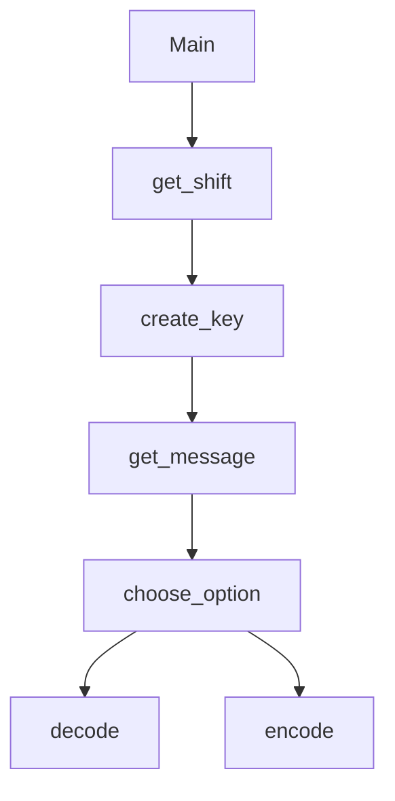

README.md
Page
1
/
1
100%
# Ceasar Cipher
Alex, Gabriel

## Ceasar Cipher Description
A very simple encoding and decoding of a Ceasar cypher.

### Ceasar Cipher Flowchart

#### Function Diagrams

| `main`    |               |  Alex     |
| ------------------ | ------------- | ------------ |
| `argument:type`    | Uses other functions in the program  |              |
***
| `get_shift`    |               |     Gabriel   |
| ------------------ | ------------- | ------------ |
| `argument:type`    | takes input from the user for number of shift (1-25)  |              |
| `shift:integer`     | calculates the cipher shift  |
***
| `choose_option`    |               |     Alex   |
| ------------------ | ------------- | ------------ |
| `argument:type`    | takes input from the user to either decode or encode  | returns the choice |
***
| `get_message`    |               |     Gabriel   |
| ------------------ | ------------- | ------------ |
| `argument:type`    | takes input from the user for a message to decode or encode  | returns the message |
***
| `create_key`    |               |     ALex   |
| ------------------ | ------------- | ------------ |
| `argument:type`    | takes shift variable | outputs a dictionary of the cipher with the shift |
***
| `encode`    |               |     Gabriel   |
| ------------------ | ------------- | ------------ |
| `argument:type`    | Takes message and key as variables | returns an encoded message with the key given |
***
| `decode`    |               |     Alex   |
| ------------------ | ------------- | ------------ |
| `argument:type`    | Takes the message and key as input | returns a decoded message with the key given |
***
Displaying README.md.
