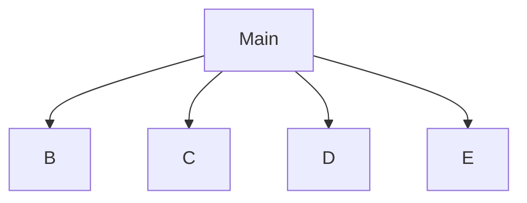

README.md
Page
1
/
1
100%
# Ceasar Cipher
Alex, Gabriel

## Ceasar Cipher Description
A very simple encoding and decoding of a Ceasar cypher.

### Ceasar Cipher Flowchart

#### Function Diagrams

| `main`    |               |  Alex     |
| ------------------ | ------------- | ------------ |
| `argument:type`    | takes input from the user for ____  |              |
| `time:integer`     | calculates ______  | outputs ____             |
| `name:string`      | takes input for name ___ | returns total |
***
| `get_shift`    |               |     Gabriel   |
| ------------------ | ------------- | ------------ |
| `argument:type`    | takes input from the user for ____  |              |
| `time:integer`     | calculates ______  | outputs ____             |
| `name:string`      | takes input for name ___ | returns total |
***
| `choose_option`    |               |     Alex   |
| ------------------ | ------------- | ------------ |
| `argument:type`    | takes input from the user for ____  |              |
| `time:integer`     | calculates ______  | outputs ____             |
| `name:string`      | takes input for name ___ | returns total |
***
| `get_message`    |               |     Gabriel   |
| ------------------ | ------------- | ------------ |
| `argument:type`    | takes input from the user for ____  |              |
| `time:integer`     | calculates ______  | outputs ____             |
| `name:string`      | takes input for name ___ | returns total |
***
| `create_key`    |               |     ALex   |
| ------------------ | ------------- | ------------ |
| `argument:type`    | takes input from the user for ____  |              |
| `time:integer`     | calculates ______  | outputs ____             |
| `name:string`      | takes input for name ___ | returns total |
***
| `encode`    |               |     Gabriel   |
| ------------------ | ------------- | ------------ |
| `argument:type`    | Takes message and key as an input  |              |
| `time:integer`     | encodes message  | outputs encoded message             |
| `name:string`      | takes input for message | returns message |
***
| `decode`    |               |     Alex   |
| ------------------ | ------------- | ------------ |
| `argument:type`    | Takes the message and key as input  |              |
| `time:integer`     | Decodes the message  | outputs decded message             |
| `name:string`      | takes input for message | returns message |
***
Displaying README.md.
